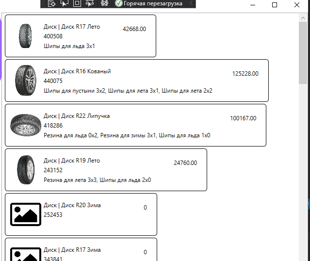

# Ресурсы и заметки по демо-экзамену 2021 (вариант 3)

Все ресурсы лежат в папке [data](./data) этого репозитория

## Восстановление базы данных из скрипта

В своей базе данных создаёте SQL-запрос, вставляете в него содержимое файла [ms.sql](./data/ms.sql) и выполняете скрипт

>В скрипте нет выбора базы. Вам нужно создавать скрипт в своей базе или в начале скрипта вписать команду `use <название вашей базы>`

## Импорт данных

1. Загружаете файлы с данными в Excel, исправляете их (данные в файлах либо испорчены, либо содержат лишнюю информацию). Основные баги:

    * в числовых полях содержиться текст ("рубли" в цене, "№ цеха" и т.п.)
    * обратный слеш (`\`) в путях. Этот символ считается служебным и его надо менять на прямой слеш (`/`). 
    * точки в числах с плавающей запятой. Microsoft преобразует текст в числа с учетом языковой среды, а для русской среды разделителем является запятая. Меняем точку на запятую
    * дата в разных форматах

2. Исправленные данные сохраняем как таблицы Excel в КОНКРЕТНОМ формате

3. Импортируете эти таблицы в БД

4. С помощью запросов `INSERT .... SELECT DISTINCT` заполняете словарные таблицы. Затем запросами `SELECT ... INSERT` переносите остальные данные

## Разработка кода

### **Макет**

В ресурсах лежит файл с макетом (внешним видом) основного экрана


Оценки за макет:

Критерий | Оценка
---------|:-----:
Список продукции отображается в соответствии с макетом | 0.5
Выводится список материалов для каждой продукции | 0.5 
Стоимость продукции рассчитана исходя из используемых материалов | 0.7
**Итого** | **1.7**

Такой внешний вид можно получить используя элемент **ListView**. В коде ничего не меняется. Рассмотрим разметку (`.xaml`)

```xml
<ListView
    Grid.Row="1"
    ItemsSource="{Binding ProductList}"
    x:Name="ProductListView">
```

По-умолчанию размер элемента списка вычисляется по содержимому




```xml
    <!-- этим кодом мы устанавливаем стиль отображения Stretch - по ширине -->
    <ListView.ItemContainerStyle>
        <Style 
            TargetType="ListViewItem">
            <Setter 
                Property="HorizontalContentAlignment"
                Value="Stretch" />
        </Style>
    </ListView.ItemContainerStyle>
```


```xml
    <!-- тут описываем шаблон одного элемента -->
    <ListView.ItemTemplate>
        <DataTemplate>
            <!-- рисуем вокруг элемента границу с загругленными углами -->
            <Border 
                BorderThickness="1" 
                BorderBrush="Black" 
                CornerRadius="5">
                <!-- основная "сетка" из 3-х столбцов: картинка, содержимое, цена -->
                <Grid 
                    Margin="10" 
                    HorizontalAlignment="Stretch">
                    <Grid.ColumnDefinitions>
                        <ColumnDefinition Width="64"/>
                        <ColumnDefinition Width="*"/>
                        <ColumnDefinition Width="100"/>
                    </Grid.ColumnDefinitions>

                    <Image
                        Width="64" 
                        Height="64"
                        Source="{Binding Path=ImagePreview}" />
                    <!-- ,TargetNullValue={StaticResource DefaultImage} -->

                    <TextBlock 
                        Text="{Binding TotalPrice}" 
                        Grid.Column="2" 
                        HorizontalAlignment="Right" 
                        Margin="10"/>

                    <!-- для содержимого рисуем вложенную сетку -->
                    <Grid Grid.Column="1" Margin="5">
                        <Grid.RowDefinitions>
                            <RowDefinition Height="20"/>
                            <RowDefinition Height="20"/>
                            <RowDefinition Height="*"/>
                        </Grid.RowDefinitions>

                        <StackPanel
                            Orientation="Horizontal">
                            <TextBlock 
                                Text="{Binding ProductType.Title}"/>
                            <TextBlock 
                                Text=" | "/>
                            <TextBlock 
                                Text="{Binding Title}"/>
                        </StackPanel>

                        <TextBlock 
                            Text="{Binding ArticleNumber}" 
                            Grid.Row="1"/>
                        <TextBlock 
                            Text="{Binding MaterialsList}" 
                            Grid.Row="2"/>
                    </Grid>
                </Grid>
            </Border>
        </DataTemplate>
    </ListView.ItemTemplate>
</ListView>
```

В разметке используются вычисляемые поля:

```cs
public partial class Product
{
    // ссылка на картинку
    // по ТЗ, если картинка не найдена, то должна выводиться картинка по-умолчанию
    // в XAML-е можно это сделать средствами разметки, но там есть условие что вместо ссылки на картинку получен NULL
    // у нас же возможна ситуация, когда в базе есть путь к картинке, но самой картинки в каталоге нет
    // поэтому я сделал проверку наличия файла картинки и возвращаю картинку по-умолчанию, если нужной нет 
    public Uri ImagePreview
    {
        get
        {
            var imageName = System.IO.Path.Combine(Environment.CurrentDirectory, Image ?? "");
            return System.IO.File.Exists(imageName) ? new Uri(imageName) : new Uri("pack://application:,,,/Images/picture.png");
        }
    }

    // список материалов, входящих в продукт
    // перебираем записи из коллекции и формируем строку
    public string MaterialsList
    {
        get
        {
            var Result = "";
            foreach(var pm in ProductMaterial)
            {
                Result += (Result=="" ? "" : ", ")+pm.Material.Title;
            }
            return Result;
        }
    }

    // общую стоимость продукта тоже считаем по цене и количеству используемых материалов
    public decimal TotalPrice
    {
        get
        {
            decimal Result = 0;
            foreach (var pm in ProductMaterial)
                Result += pm.Material.Cost;
            return Result;
        }
    }
}
```


### **Постраничный вывод (пагинация)**

Сама пагинация делается элементарно, есть заморочки с выводом списка страниц, но мы их пока пропустим.

Оценки за пагинацию:

Критерий | Оценка
---------|:-----:
Данные выводятся постранично | 1
Выводится по 20 записей на странице | 0.2 
~~Выводится список номеров страниц~~ | 0.5
~~Реализован переход на выбранную в списке страницу~~ | 0.5
Присутствует возможность перемещаться на предыдущую и следующую страницы | 0.5
**Итого** | **1.7**

Я пока не останавливаюсь на формировании списка страниц, но просто повесить переход на предыдущую и следующу страницы довольно просто, а баллы на дороге не валяются.

**Разметка**

В самом списке ничего менять не надо, под списком в отдельной строке сетки добавляем кнопки для перехода вперед и назад и номер текущей страницы:

```xml
<StackPanel 
    Grid.Row="2" 
    HorizontalAlignment="Right" 
    Orientation="Horizontal">
    <Button 
        Content="Предыдущая" 
        Name="PrevPage" 
        Click="PrevPage_Click"/>
    <TextBlock 
        Text="{Binding CurrentPage, StringFormat=Страница {0}}" 
        VerticalAlignment="Center" 
        Margin="5"/>
    <Button 
        Content="Следующая" 
        Name="NextPage" 
        Click="NextPage_Click"/>
</StackPanel>
```

**Код**

1. Создаем свойство для хранения номера текущей страницы

    ```cs
    private int _CurrentPage = 1;

    public int CurrentPage
    {
        get
        {
            return _CurrentPage;
        }
        set
        {
            // тут проверка, чтобы номер не уходил в минус и в плюс
            if (value > 0)
            {
                if (value <= _ProductList.Count() / 20)
                {
                    _CurrentPage = value;
                    Invalidate();
                }
            }
        }
    }
    ```

2. Правим геттер основного списка:

    ```cs
    public IEnumerable<Product> ProductList
    {
        get
        {
            var Result = _ProductList;

            ... // тут все фильтры

            // Skip - пропускает заданное количество записей
            // Take - выбирает заданное количество записей
            return Result
                .Skip((CurrentPage-1)*20)
                .Take(20);
        }
        ...
    ```

3. Реализуем обработчики кнопок вперед и назад

    ```cs
    private void PrevPage_Click(object sender, RoutedEventArgs e)
    {
        CurrentPage--;
    }

    private void NextPage_Click(object sender, RoutedEventArgs e)
    {
        CurrentPage++;
    }
    ```

### **Выбор типа сортировки из выпадающего списка**

Оценки за выбор типа сортировки:

Критерий | Оценка
---------|:-----:
Реализована сортировка по наименованию продукции | 0.2
Реализована сортировка по номеру цеха | 0.2 
Реализована сортировка по минимальной стоимости для агента | 0.2
Выбор сортировки реализован с помощью выпадающего списка | 0.5
**Итого** | **1.1**

Почему-то Ларионов на этом сломался, хотя тут всё просто:

1. Создаем массив со списком типов сортировок (массив ОБЯЗАТЕЛЬНО должен быть **свойством**, т.е. иметь `{ get; set; }`, иначе разметка его не увидит)

    ```cs
    public string[] SortList { get; set; } = {
        "Без сортировки",
        "название по убыванию",
        "название по возрастанию",
        "номер цеха по убыванию",
        "номер цеха по возрастанию",
        "цена по убыванию",
        "цена по возрастанию" };
    ```

2. В разметке добавляем выпадающий список

    ```xml
    <WrapPanel 
        Orientation="Horizontal" 
        ItemHeight="50">
        <Label 
            Content="Сортировка: "
            Margin="10,0,0,0"
            VerticalAlignment="Center"/>
        <ComboBox
            Name="SortTypeComboBox"
            SelectedIndex="0"
            VerticalContentAlignment="Center"
            MinWidth="200"
            SelectionChanged="SortTypeComboBox_SelectionChanged"
            ItemsSource="{Binding SortList}"/>
    </WrapPanel>
    ```

3. В событии выбора элемента списка запоминаем ИНДЕКС выбранного элемента

    ```cs
    private void SortTypeComboBox_SelectionChanged(object sender, SelectionChangedEventArgs e)
    {
        SortType = SortTypeComboBox.SelectedIndex;
        Invalidate();
    }
    ```

4. И в геттере основного списка добавляем, если нужно, сортировку

    ```cs
    public IEnumerable<Product> ProductList
    {
        get
        {
            var Result = _ProductList;

            switch (SortType)
            {
                case 1:
                    Result = Result.OrderBy(p => p.Title);
                    break;
                case 2:
                    Result = Result.OrderByDescending(p => p.Title);
                    break;
                ... // тут дописать остальные 4 варианта    
            }

            return Result
                .Skip((CurrentPage-1)*20)
                .Take(20);
        }
        ...
    ```