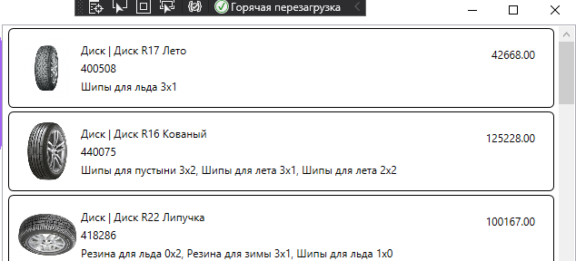

# Ресурсы и заметки по демо-экзамену 2021 (вариант 3)

Все ресурсы лежат в папке [data](./data) этого репозитория

## Восстановление базы данных из скрипта

В своей базе данных создаёте SQL-запрос, вставляете в него содержимое файла [ms.sql](./data/ms.sql) и выполняете скрипт

>В скрипте нет выбора базы. Вам нужно создавать скрипт в своей базе или в начале скрипта вписать команду `use <название вашей базы>`

## Импорт данных

1. Загружаете файлы с данными в Excel, исправляете их (данные в файлах либо испорчены, либо содержат лишнюю информацию). Основные баги:

    * в числовых полях содержиться текст ("рубли" в цене, "№ цеха" и т.п.)
    * обратный слеш (`\`) в путях. Этот символ считается служебным и его надо менять на прямой слеш (`/`). 
    * точки в числах с плавающей запятой. Microsoft преобразует текст в числа с учетом языковой среды, а для русской среды разделителем является запятая. Меняем точку на запятую
    * дата в разных форматах

2. Исправленные данные сохраняем как таблицы Excel в КОНКРЕТНОМ формате

3. Импортируете эти таблицы в БД

4. С помощью запросов `INSERT .... SELECT DISTINCT` заполняете словарные таблицы. Затем запросами `SELECT ... INSERT` переносите остальные данные

## Разработка кода

1. Макет

    В ресурсах лежит файл с макетом (внешним видом) основного экрана

    

    Такой внешний вид можно получить используя элемент **ListView**. В коде ничего не меняетс. Рассмотрим разметку (`.xaml`)

    ```xml
    <ListView
        Grid.Row="1"
        ItemsSource="{Binding ProductList}"
        x:Name="ProductListView">
    ```

    По-умолчанию размер элемента списка вычисляется по содержимому

    


    ```xml
        <!-- этим кодом мы устанавливаем стиль отображения Stretch - по ширине -->
        <ListView.ItemContainerStyle>
            <Style 
                TargetType="ListViewItem">
                <Setter 
                    Property="HorizontalContentAlignment"
                    Value="Stretch" />
            </Style>
        </ListView.ItemContainerStyle>
    ```

    


    ```xml
        <!-- тут описываем шаблон одного элемента -->
        <ListView.ItemTemplate>
            <DataTemplate>
                <!-- рисуем вокруг элемента границу с загругленными углами -->
                <Border 
                    BorderThickness="1" 
                    BorderBrush="Black" 
                    CornerRadius="5">
                    <!-- основная "сетка" из 3-х столбцов: картинка, содержимое, цена -->
                    <Grid 
                        Margin="10" 
                        HorizontalAlignment="Stretch">
                        <Grid.ColumnDefinitions>
                            <ColumnDefinition Width="64"/>
                            <ColumnDefinition Width="*"/>
                            <ColumnDefinition Width="100"/>
                        </Grid.ColumnDefinitions>

                        <Image
                            Width="64" 
                            Height="64"
                            Source="{Binding Path=ImagePreview}" />
                        <!-- ,TargetNullValue={StaticResource DefaultImage} -->

                        <TextBlock 
                            Text="{Binding TotalPrice}" 
                            Grid.Column="2" 
                            HorizontalAlignment="Right" 
                            Margin="10"/>

                        <!-- для содержимого рисуем вложенную сетку -->
                        <Grid Grid.Column="1" Margin="5">
                            <Grid.RowDefinitions>
                                <RowDefinition Height="20"/>
                                <RowDefinition Height="20"/>
                                <RowDefinition Height="*"/>
                            </Grid.RowDefinitions>

                            <StackPanel
                                Orientation="Horizontal">
                                <TextBlock 
                                    Text="{Binding ProductType.Title}"/>
                                <TextBlock 
                                    Text=" | "/>
                                <TextBlock 
                                    Text="{Binding Title}"/>
                            </StackPanel>

                            <TextBlock 
                                Text="{Binding ArticleNumber}" 
                                Grid.Row="1"/>
                            <TextBlock 
                                Text="{Binding MaterialsList}" 
                                Grid.Row="2"/>
                        </Grid>
                    </Grid>
                </Border>
            </DataTemplate>
        </ListView.ItemTemplate>
    </ListView>
    ```

    В разметке используются вычисляемые поля:

    ```cs
    public partial class Product
    {
        // ссылка на картинку
        // по ТЗ, если картинка не найдена, то должна выводиться картинка по-умолчанию
        // в XAML-е можно это сделать средствами разметки, но там есть условие что вместо ссылки на картинку получен NULL
        // у нас же возможна ситуация, когда в базе есть путь к картинке, но самой картинки в каталоге нет
        // поэтому я сделал проверку наличия файла картинки и возвращаю картинку по-умолчанию, если нужной нет 
        public Uri ImagePreview
        {
            get
            {
                var imageName = System.IO.Path.Combine(Environment.CurrentDirectory, Image ?? "");
                return System.IO.File.Exists(imageName) ? new Uri(imageName) : new Uri("pack://application:,,,/Images/picture.png");
            }
        }

        // список материалов, входящих в продукт
        // перебираем записи из коллекции и формируем строку
        public string MaterialsList
        {
            get
            {
                var Result = "";
                foreach(var pm in ProductMaterial)
                {
                    Result += (Result=="" ? "" : ", ")+pm.Material.Title;
                }
                return Result;
            }
        }

        // общую стоимость продукта тоже считаем по цене и количеству используемых материалов
        public decimal TotalPrice
        {
            get
            {
                decimal Result = 0;
                foreach (var pm in ProductMaterial)
                    Result += pm.Material.Cost;
                return Result;
            }
        }
    }
    ```